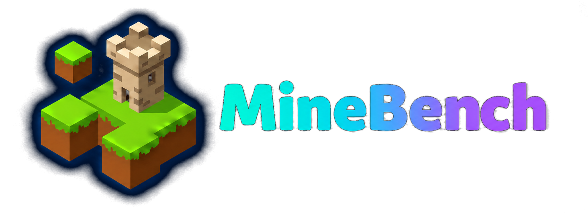
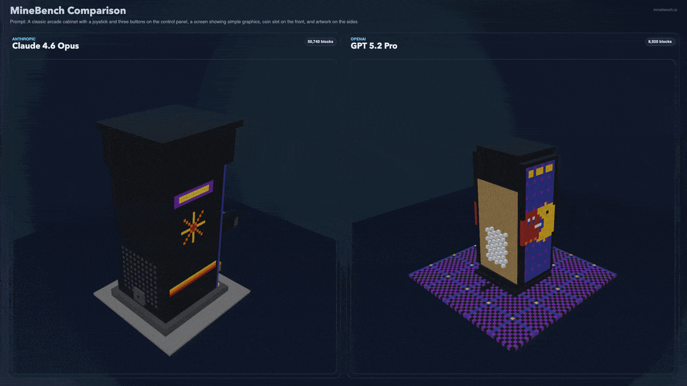
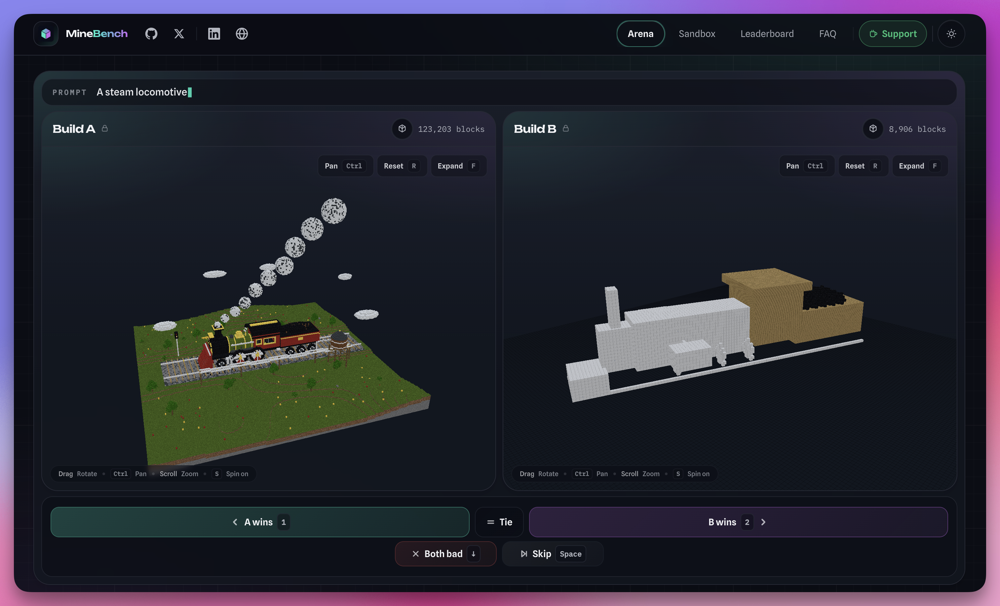
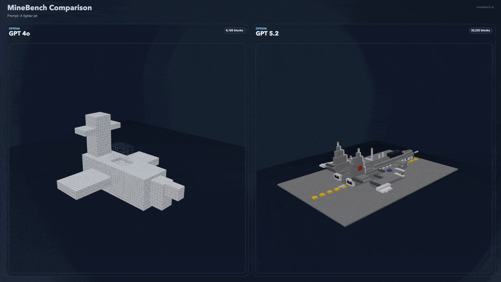
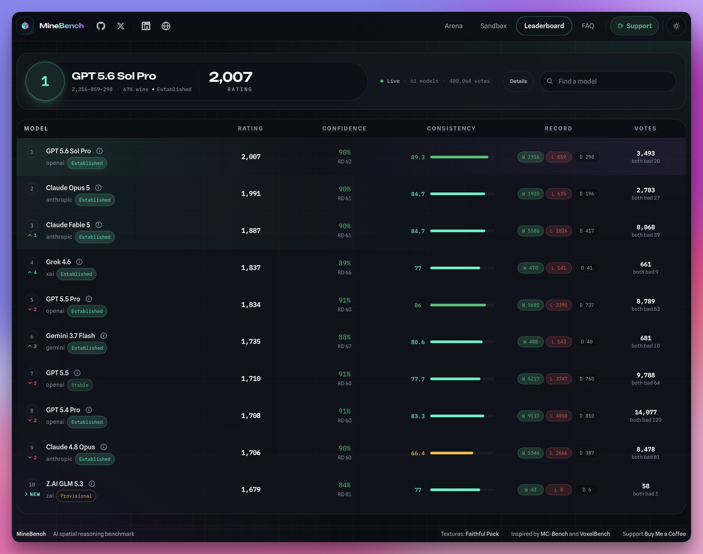

<p align="center">
  <a href="https://minebench.ai">
    
  </a>
</p>

<p align="center">
  <a href="https://minebench.ai"></a>
  <a href="https://alpha.minebench.ai"></a>
  <a href="https://apps.apple.com/app/minebench/id6803704037"></a>
  <a href="https://github.com/Ammaar-Alam/minebench/releases/latest"></a>
  <a href="LICENSE"></a>
</p>

<p align="center">
  <a href="docs/README.md"></a>
  <a href="https://buymeacoffee.com/ammaaralam"></a>
  <a href="https://x.com/minebench_ai"></a>
</p>

<h1 align="center">MineBench</h1>

**A benchmark for evaluating AI spatial reasoning through Minecraft-style voxel construction.**

Models are given a natural-language prompt and must produce raw 3D coordinates as JSON. In tool mode, models call `voxel.exec` (minimal primitives: `block`, `box`, `line`) to generate large builds beyond token-only JSON limits. MineBench visualizes the output and ranks models from blind head-to-head votes using a global Bradley-Terry model with uncertainty intervals.

**[Try it live](https://minebench.ai)**




> [!Note]
> MineBench is not technically a 'benchmark' as it has no objectively correct answers; it is a take on the <a href="https://arxiv.org/abs/2403.04132">LMSYS Chatbot Arena</a>. Many use MineBench to get the general feel or "vibe" of a model. AI labs may use MineBench to privately A/B test model checkpoints.

## Why MineBench?

Most LLM benchmarks test text and raw accuracy. MineBench instead tests whether a model can reason about 3D space. Given a prompt like "a medieval castle with four towers", the model must mentally construct geometry, pick materials, and output thousands of precise block coordinates. No vision model or diffusion – just math and spatial logic.

As it turns out, this kind of spatial reasoning correlates strongly with a model's raw general intelligence; the MineBench leaderboard tracks, anecdotally, the same hierarchy that most people observe in real-world usage: the smartest reasoning models are clearly visible when asked to produce visual builds.

MineBench, unlike other benchmarks, gives an easy way to visually determine (at least one aspect of) a model's raw intelligence. The ranking system also highlights which models are clearly 'bench-maxed' (i.e. when a model has amazing benchmarks on paper, but clearly lacks in real world usage).



## Features

* **Arena** — blind head-to-head comparisons of pre-generated builds with confidence-aware ranking
* **Sandbox** — compare existing builds, generate new ones, or import output from any model
* **Gallery** — explore community prompts and keep signed-in generations
* **Leaderboard** — live rankings with win/loss/draw stats across all models
* **Exports** — save builds as GLB, STL, or WorldEdit `.schem` for Blender, 3D printing, and Minecraft

## Documentation

* Full docs index: [`docs/README.md`](docs/README.md)
* Local development: [`docs/local-development.md`](docs/local-development.md)
* Operations and API reference: [`docs/operations.md`](docs/operations.md)
* Gallery and saved generations: [`docs/gallery.md`](docs/gallery.md)
* Arena ranking: [`docs/arena-ranking-system.md`](docs/arena-ranking-system.md)
* Build export and imports: [`docs/build-export-import.md`](docs/build-export-import.md)

## Frequently Asked Questions

The full FAQ is available at **[minebench.ai/faq](https://minebench.ai/faq)**. Every answer has a stable link for sharing or citation.

### About MineBench

* [What is MineBench?](https://minebench.ai/faq#what-is-minebench)
* [How do models actually create the builds?](https://minebench.ai/faq#how-do-models-create-builds)
* [Why do some models add objects or scenery that were not explicitly requested?](https://minebench.ai/faq#why-do-models-add-extra-scenery)

### Methodology

* [How are models ranked if there is no single correct build?](https://minebench.ai/faq#how-are-models-ranked)
* [Can models train on MineBench or “benchmax” it?](https://minebench.ai/faq#can-minebench-be-contaminated-or-benchmaxxed)
* [How do grid size, block limits, and different leaderboard settings work?](https://minebench.ai/faq#how-do-grid-size-block-limits-and-leaderboard-settings-work)
* [Why not add more prompts, grid sizes, block-limited settings, and other evaluation modes?](https://minebench.ai/faq#why-not-add-more-evaluation-modes)
* [Are generations one-shot?](https://minebench.ai/faq#are-generations-one-shot)

### Using MineBench

* [Can I compare different models directly?](https://minebench.ai/faq#can-i-compare-models-directly)
* [Can models that are not on the official leaderboard be tested?](https://minebench.ai/faq#can-unofficial-models-be-tested)
* [Why isn't a particular model on the leaderboard?](https://minebench.ai/faq#why-is-a-model-missing)
* [Can MineBench builds be exported?](https://minebench.ai/faq#can-i-export-builds)
* [Is MineBench using Minecraft MCP, Blender MCP, or a coding agent?](https://minebench.ai/faq#is-this-minecraft-mcp-blender-mcp-or-a-coding-agent)
* [How can MineBench be supported or contributed to?](https://minebench.ai/faq#how-can-i-support-or-contribute)

## Supported Models

MineBench currently benchmarks models from OpenAI, Anthropic, Google, Moonshot, DeepSeek, MiniMax, xAI, Z.AI, Qwen, Meta, and any model available through OpenRouter.



## Quick Start (Local)

This path lets you run the full app and compare existing builds from `uploads/` without generating new ones.

Prereqs: Node.js `18+`, `pnpm`, Docker.

```bash
pnpm install
cp .env.example .env
pnpm dev:setup
```

In a second terminal:

```bash
pnpm prompt --import
```

Then open:

* `http://localhost:3000/` (Arena)
* `http://localhost:3000/sandbox`
* `http://localhost:3000/leaderboard`

For environment variables, live generation, seeding/import workflows, batch generation, API routes, troubleshooting, and deployment, see the docs:

* [`docs/local-development.md`](docs/local-development.md)
* [`docs/operations.md`](docs/operations.md)
* [`docs/deployment.md`](docs/deployment.md)

## Sponsors

A huge thank you to the sponsors helping make MineBench possible:

* **[3D-Agent](https://3d-agent.com)**
  * AI-powered tools for Blender and 3D workflows
  * **10% off with code `MINEBENCH10`**
* **OpenAI**
* **Anthropic**
* **Google DeepMind**
* **Z.ai**
* **Moonshot AI**

Their support, including API credits, helps fund MineBench evaluations. If you would like to support MineBench yourself, you can **[support us here](https://buymeacoffee.com/ammaaralam)**.

## Contributing

Contributions are welcome! See [CONTRIBUTING.md](.github/CONTRIBUTING.md) for how to add new models, submit benchmark prompts, improve the UI, or fix bugs.

## Licenses

[MIT](LICENSE)

Texture pack: [Faithful](https://faithfulpack.net/) (see `assets/texture-pack/LICENSE.txt`)

Inspired by [MC-Bench](https://github.com/mc-bench) and [VoxelBench](https://voxelbench.ai/)
