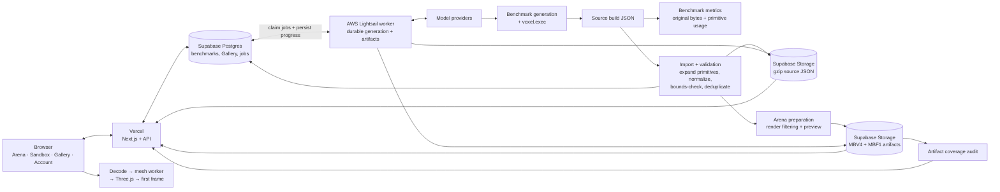
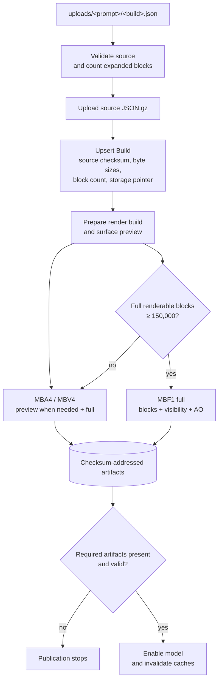
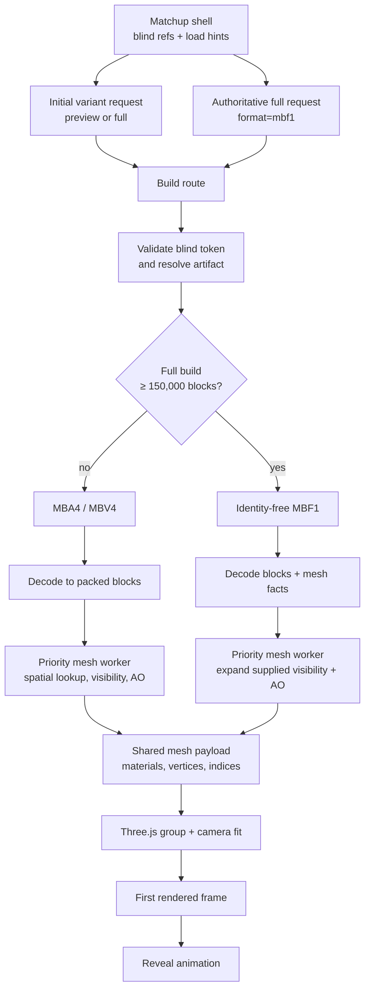
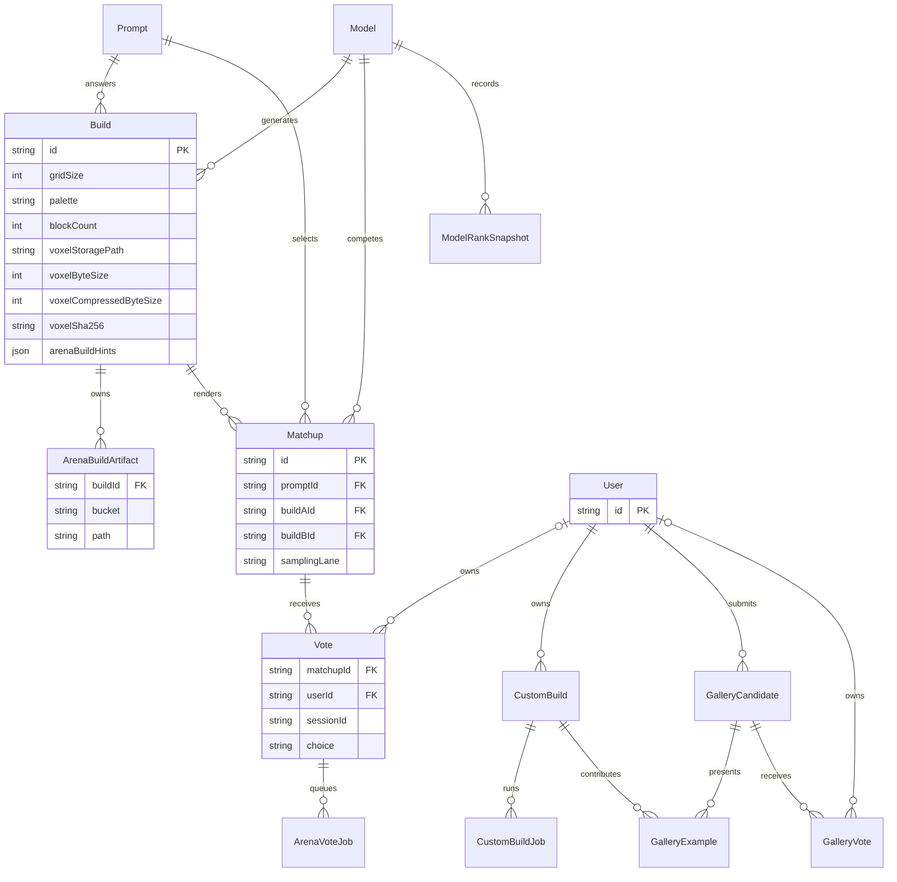

# Architecture

MineBench keeps benchmark evidence separate from the optimized data sent to the
viewer. A model's source JSON remains the reproducible record used for metrics,
while validated builds are compiled into compact, immutable render artifacts.

## System map

The source and render paths intentionally diverge after import. Expanding a
`box` or `line`, removing an invalid block, or filtering hidden render data does
not rewrite the original model output or its benchmark metrics.

## Build representations

| Representation | Role | Contents |
| --- | --- | --- |
| Source JSON | Benchmark record and reprocessing source | `blocks`, `boxes`, and `lines` exactly as produced or imported |
| MBV4 | Compact validated block data | Palette names plus packed coordinates and palette indices |
| MBA4 | Arena delivery container for MBV4 | Small response metadata followed by an MBV4 body |
| MBF1 | Pre-meshed facts for large full builds | MBV4 blocks, visible-face masks, and packed ambient-occlusion levels |

The stored `.mbv4` arena object is an MBA4 container whose block body uses
MBV4. MBF1 is used for full builds with at least 150,000 validated renderable
blocks. It moves face visibility and ambient-occlusion work out of the browser's
critical path while preserving the same final Three.js geometry contract.

Gzip wraps source and derived artifacts in Storage and over the network; it is
transport compression, not another build representation.

## Import and publication

`pnpm model:publish` coordinates import, missing-only artifact generation,
coverage verification, metric refresh, and activation. The same native artifact
maintenance runs when new builds are imported, so future builds do not require
a separate MBF1 migration.

Derived objects are immutable and checksum-addressed. `ArenaBuildArtifact`
rows record which build owns each Storage object so lifecycle cleanup can remove
unreferenced artifacts without guessing from path names.

## Saved generations

Signed-in Sandbox requests enqueue one durable Postgres job per model. The AWS
worker claims those jobs with renewable leases, calls the selected providers,
and writes canonical JSON plus derived viewer and thumbnail artifacts to private
Storage. Persisted progress lets account and Gallery views survive navigation,
browser closure, and worker restarts.

Provider credentials are encrypted for one job and removed at terminal state.
Provider calls are bounded so a broken endpoint cannot occupy a worker lane
forever. Downloads use short-lived private object access.

## Arena delivery and rendering

Arena refs do not expose the canonical build identity before voting. MBF1 has
no embedded build ID or checksum, so its stored gzip body can pass through the
private build route unchanged. Smaller MBA4 responses are rewritten to the
blind request identity before delivery.

The two-worker mesh pool prioritizes currently visible lanes. MBF1 skips the
worker's spatial-table construction, hidden-face traversal, and AO neighborhood
queries; it still builds the final vertex and index buffers needed by Three.js.

## Core data model

Postgres contains relational state and payload metadata, not large render
artifacts. Supabase Storage contains the source JSON and derived binary objects.
Vercel route handlers own sampling, blind-token validation, artifact resolution,
and response observability; the browser owns decoding, geometry construction,
and rendering.

Public votes remain valid without an account and use the browser session as their
duplicate-vote boundary. A signed-in vote can also have an optional `User` owner;
sign-in claims unowned public votes from the same session. Private-evaluation
votes are never assigned to public accounts. Deleting an account clears vote
ownership while retaining the aggregate vote history.
